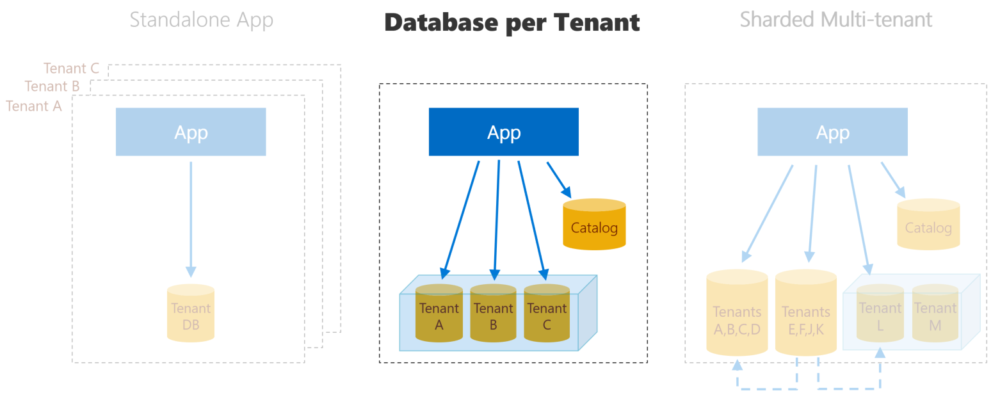

# Wingtip Tickets SaaS - Database per Tenant
Sample multi-tenant SaaS application and management scripts built on SQL Database using a database-per-tenant model.



Looking for one of the other SaaS app patterns? Learn more about the [Standalone application](https://github.com/Microsoft/WingtipTicketsSaaS-StandaloneApp) and [Sharded multi-tenant](https://github.com/Microsoft/WingtipTicketsSaaS-MultiTenantDb) versions.

### Wingtip Tickets SaaS app

The Wingtip Tickets app is a simple event listing and ticketing SaaS app, where each venue is a tenant with events, ticket prices, customers, and ticket sales. The app, together with the management scripts and tutorials, showcases an end-to-end SaaS scenario. This includes provisioning tenants, monitoring and managing performance, schema management and cross-tenant reporting and analytics, all at scale. This application is functionally identical across all three versions repositories.

### Database per tenant SaaS pattern

This project showcases the database per tenant model. This model is effective for service providers that are concerned with tenant isolation and want to run a centralized service that allows cost-efficient use of shared resources. A database is created for each venue, or tenant, and all the databases are centrally managed. They can be hosted in elastic pools to provide cost-efficient and easy performance management, which leverages the unpredictable usage patterns of the tenants. A catalog database holds the mapping between tenants and their databases. This mapping is managed using the shard map management features of the Elastic Database Client Library, which also provides efficient connection management to the application.

## Get started - Deploy sample app

>**NOTE:** If you install the application, you will be charged for the Azure resources created.  Actual costs incurred are based on your subscription offer type but are nominal if the application is not scaled up unreasonably and is deleted promptly after you have finished exploring the tutorials.

The basic application, which includes three sample databases for three venues, installs in your Azure subscription under a single ARM resource group.  To uninstall the application, delete the resource group from the Azure Portal.

To deploy the app to Azure, click the link below.  Deploy the app in a new resource group, and provide a short *user* value that is appended to resource names to make them globally unique.  Your initials and a number is a good pattern to use.


<a href="https://aka.ms/deploywingtipdpt" target="_blank">
    
</a>

After deployment completes, launch the app by browsing to ```http://events.wingtip-dpt.USER.trafficmanager.net``` in a web browser, substituting *USER* with the value you set during deployment.

## Get started - Run management scripts and tutorials

>**IMPORTANT:** If you download and extract the repo or [Learning Modules](https://github.com/Microsoft/WingtipSaaS/tree/master/Learning%20Modules) from a zip file, make sure you unblock the .zip file before extracting. Executable contents (scripts, dlls) may be blocked by Windows when zip files are downloaded from an external source and extracted.

>To avoid scripts from being blocked by Windows:

>1. Right click the zip file and select **Properties**.
>2. On the **General** tab, select **Unblock** and select **OK**.

You will find management scripts in the repo that allow you to explore many SaaS management scenarios, including provisioning tenants and monitoring performance, managing database schema, analytics, and more. You can find the tutorials associated with these scripts in [Azure SQL database documentation](https://docs.microsoft.com/en-us/azure/sql-database/saas-dbpertenant-wingtip-app-overview).

Also available in the Documentation folder in this repo is an **overview presentation** that provides background, explores alternative database models, and walks through several of the SaaS patterns at a high level. There is also a demo script you can use with the presentation to give others a guided tour of the app and several of the patterns.


## License
Microsoft Wingtip SaaS sample application and tutorials are licensed under the MIT license. See the [LICENSE](https://github.com/Microsoft/WingtipSaaS/blob/master/license) file for more details.

# Contributing

This project has adopted the [Microsoft Open Source Code of Conduct](https://opensource.microsoft.com/codeofconduct/). For more information see the [Code of Conduct FAQ](https://opensource.microsoft.com/codeofconduct/faq/) or contact [opencode@microsoft.com](mailto:opencode@microsoft.com) with any additional questions or comments.
